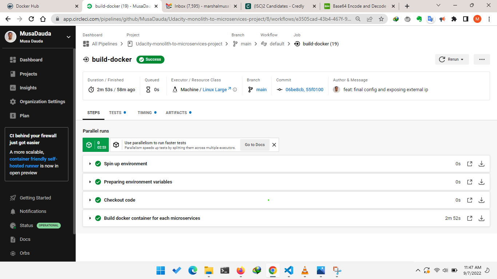

# Screenshots
To help review your infrastructure, please include the following screenshots in this directory::

## Deployment Pipeline
* DockerHub showing containers that you have pushed
* GitHub repository’s settings showing your Travis webhook (can be found in Settings - Webhook)
* Travis CI showing a successful build and deploy job
Payment for travis CI uses stripe api which is not yet supported in my country as a result I used CircleCI instead.


## Kubernetes
* To verify Kubernetes pods are deployed properly
```bash
kubectl get pods
```
* To verify Kubernetes services are properly set up
```bash
kubectl describe services
```
* To verify that you have horizontal scaling set against CPU usage
```bash
kubectl describe hpa
```
* To verify that you have set up logging with a backend application
```bash
kubectl logs {pod_name}
```
